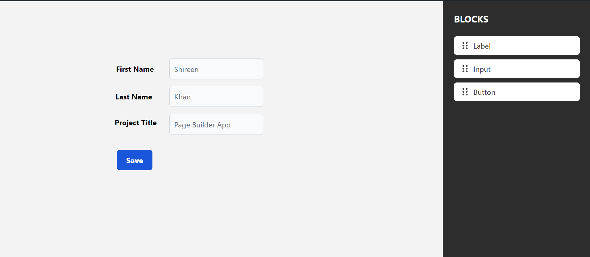

# Page Builder App

React Page Builder enables easy drag-and-drop functionality for adding Labels, Inputs, and Buttons onto a canvas. Users can configure element positions and properties, with automatic local storage for seamless persistence.

## Features

Following are the key features of page-builder project:

- Drag-and-Drop Interface: Users can easily drag elements from the sidebar onto the blank canvas to design their web page layout.

- Configuration Modal: Upon dropping an element onto the canvas, a configuration modal automatically appears, allowing users to fine-tune properties such as X and Y coordinates. The X and Y coordinates are auto-filled based on the mouse position where the element was dropped.

- Dynamic Element Manipulation: Users can freely move elements around the canvas by dragging them to different positions. When an element is selected, a red-colored border highlights it, indicating its selection status.

- Configuration Update: Users can update the configuration of selected elements by pressing Enter, which opens a modal similar to the initial configuration setup, enabling them to make changes as needed.

- Deletion Functionality: Selected elements can be deleted by pressing the delete key, removing them from the canvas.

- Automatic Persistence: All changes made to the canvas, including adding, updating, moving, or deleting elements, are automatically saved to local storage. This ensures that user progress is consistently preserved and can be accessed across sessions

## Installation

Install & run the project with npm

```bash
  npm install
```

```bash
  npm run dev
```

## User Guide

1. **Getting Started:**

   - Run the npm commands and open the Page Builder application in your web browser.
   - You'll be greeted with a blank canvas and a sidebar containing three elements: Label, Input, and Button.

2. **Adding Elements to the Canvas:**

   - To add an element, simply click and hold on the desired element in the sidebar.
   - Drag the element onto the blank canvas.
   - Release the mouse button/pointer to drop the element onto the canvas.

3. **Configuring Element Properties:**

   - Upon dropping an element onto the canvas, a configuration modal will automatically appear.
   - Adjust the properties such as lable/input/button name, font size, font weight as needed.
   - Click on "Save Changes" to apply the configuration.

4. **Moving Elements on the Canvas:**

   - To move an element, click and hold on it.
   - Drag the element to the desired position on the canvas.
   - Release the mouse button to drop the element into the new position.

5. **Selecting Elements:**

   - Click on an element on the canvas to select it.
   - A red-colored border will appear around the selected element, indicating its selection status.

6. **Updating Element Configuration:**

   - With an element selected, press the Enter key.
   - A configuration modal similar to step 3 will appear, allowing you to update the properties of the selected element.
   - Click on "Save Changes" to apply the updates.

7. **Deleting Elements:**

   - Select the element you wish to delete by clicking on it.
   - Press the Delete key on your keyboard.
   - The selected element will be removed from the canvas.

8. **Automatic Data Persistence:**

   - All changes made to the canvas, including adding, updating, moving, or deleting elements, are automatically saved to local storage.
   - Your progress will be preserved even if you close or refresh the page.

9. **Enjoy Your Page Building Experience:**

   - Explore the intuitive drag-and-drop interface and customize your web page layout effortlessly.
   - Create stunning web pages tailored to your needs with ease.

10. **Feedback and Support:**
    If you encounter any issues or have suggestions for improvement, feel free to reach out, I am open to learn.

## Tech Stack

We opted for React-18 due to its versatility and efficiency in developing dynamic user interfaces. Its component-based architecture facilitates modular development, ensuring scalability and maintainability.

- Coupled with dnd-kit https://dndkit.com/ , we achieved smooth drag-and-drop functionality, enhancing user interaction.
- Integrating the useLocalStorage hook from https://usehooks-ts.com/ ensured seamless data persistence.
- Utilizing Tailwind CSS https://tailwindcss.com/docs/guides/create-react-app and Flowbite https://flowbite.com/ streamlined the UI development process, resulting in a visually appealing and responsive page builder experience.

## More Info

- **Icon:** Utilized an SVG image of a vertical grip for drag-and-drop functionality.

- **Colors:**
  - Canvas: #f3f3f3
  - Blockspallate: #2d2d2d
  - Additional: White (as per mock-up)

## Lessons Learned

While building this project, I had the opportunity to learn and implement the dnd-kit (drag and drop toolkit for React) for the first time. It was a wonderful learning experience, as I gained a deeper understanding of how to incorporate drag-and-drop functionality seamlessly into React applications. I learned about the various features and capabilities of dnd-kit, including draggable elements, droppable containers, and customizing drag behaviors. Additionally, I honed my skills in managing state and user interactions within a dynamic UI environment. Overall, this project provided valuable insights into building more interactive and user-friendly web applications.

# React + Vite

This template provides a minimal setup to get React working in Vite with HMR and some ESLint rules.

Currently, two official plugins are available:

- [@vitejs/plugin-react](https://github.com/vitejs/vite-plugin-react/blob/main/packages/plugin-react/README.md) uses [Babel](https://babeljs.io/) for Fast Refresh
- [@vitejs/plugin-react-swc](https://github.com/vitejs/vite-plugin-react-swc) uses [SWC](https://swc.rs/) for Fast Refresh
